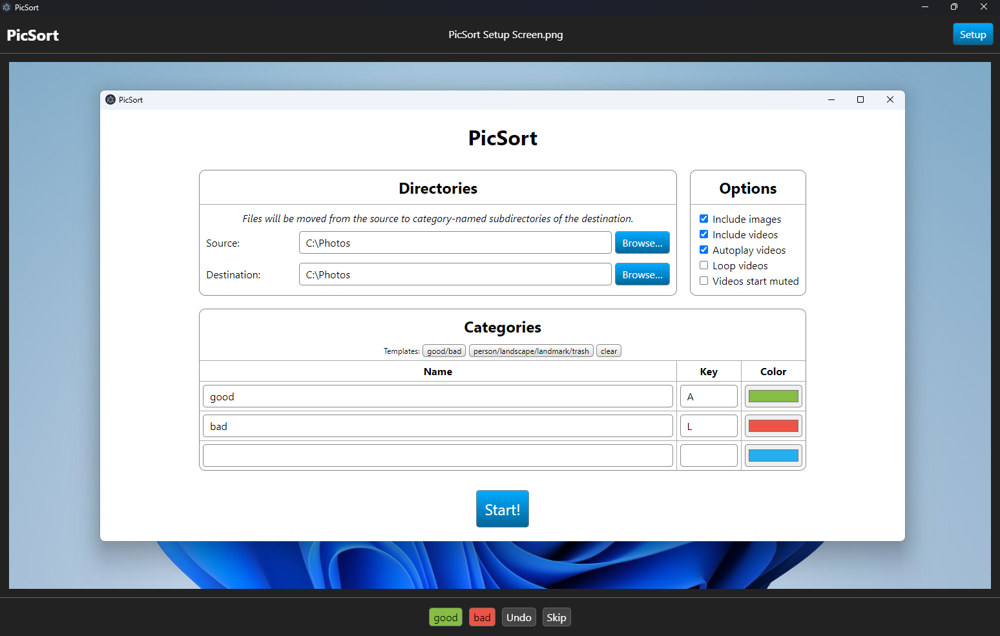

# PicSort

Organize your photos and videos into directories.

## How it looks

_PicSort in dark mode sorting a screenshot of PicSort’s setup screen in light mode._

## How it works

Give it a source folder, a destination folder (can be the same as the source), and a list of categories. The app will display your photos and videos one-by-one, allowing you to select a category (subfolder of the destination) to move it to. The end result is your photos and videos, grouped/tagged, and without involving any proprietary library/tagging systems — you own your photos.

The app can be entirely keyboard-controlled — each category has a corresponding key on the keyboard.

It is built on top of Electron, which may mean a lot of RAM usage, but it also means it is likely to be able to display all your photos and videos reasonably well due to the use of the Chromium browser engine.

It is written in TypeScript, and does not use any fancy frameworks and libraries — just good old DOM manipulation. (Writing significant front-end code this way is a lost art. It works great for this app’s interaction model though, a SPA framework would only have made things harder.)

## How to use it

The easiest way: `npm install && npm start`

Additionally, a Windows build is available in [Releases](https://github.com/K-Wojciechowski/PicSort/releases).

## Caveats

Videos are supported with the assumption that they are reasonably small. Large videos work (I successfully tested with a 4.25 GB 8K video taken from YouTube), but they may cause slowdowns and consume a lot of RAM.

Moving files between filesystems is supported, but since the app moves files as soon as you choose a category, it will probably be slower and less pleasant than moving the files afterwards, manually.

## Roadmap

This is effectively a complete project, no new significant features are expected to be added (but if you’re missing something, [report an issue](https://github.com/K-Wojciechowski/PicSort/issues)).

## Infrequently asked questions

**Why does the _good/bad_ preset use `A` and `L` as keys?** They are on opposite ends of the QWERTY keyboard’s home row, which suggests the use of two hands, which I’ve found to be harder to mess up. (This is entirely unscientific.)

**Do you take any responsibility if anything breaks?** Of course not. This is MIT-licensed open-source software.
